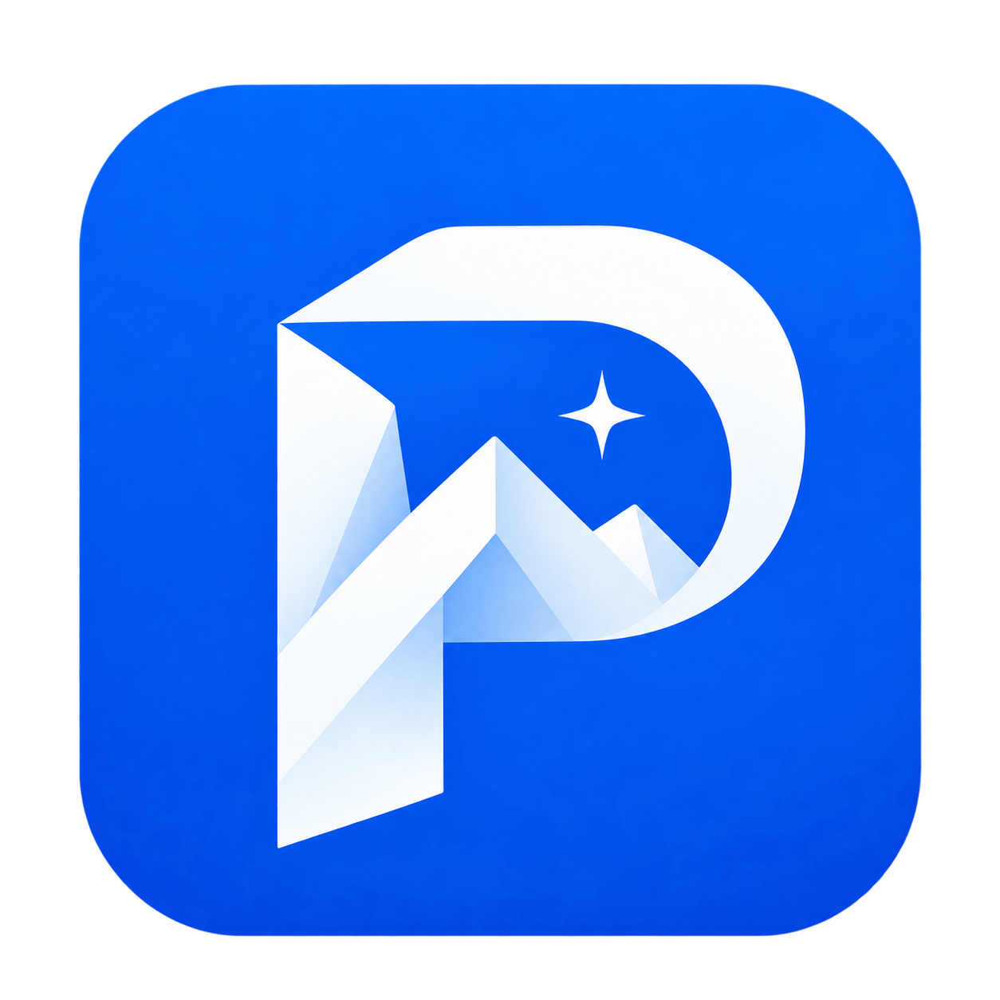
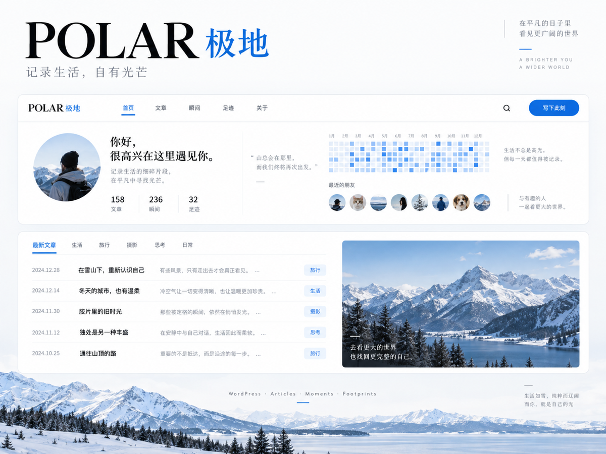

<p align="center"></p>
<h1 align="center">Polar · 极地</h1>
<p align="center">记录生活，自有光芒。</p>
<p align="center"><a href="https://xifeng.net">作者网站 · xifeng.net</a> · <a href="docs/README.md">使用文档</a></p>

极地是一款面向个人博客的 WordPress 主题，以清晰的内容层级、蓝色点缀和深浅配色，呈现文章、说说、旅行足迹与朋友之间的互动。

> 当前版本：0.5.2，持续开发中。请在测试站验证后再用于生产站点。

## 主题预览



上图为主题设计概念图，并非当前运行网站的实拍截图；具体页面以实际安装效果为准。

## 功能

- **首页内容聚合**：Hero 欢迎区域、站点动态热力图、分类切换、文章排序与分页、悬浮特色图预览。
- **文章阅读**：阅读辅助、文章信息与版权、代码高亮，以及统一的搜索、分类和关键词列表。
- **说说**：独立便签式记录页面，管理员发布、编辑与图片管理。
- **旅行足迹**：文章独立勾选收录，地点坐标与旅行日期；全屏地图、平面 / 立体 / 地球视图、多种 Mapbox 风格与地球背景设置。
- **朋友与评论**：友链动态、评论等级、系统与浏览器标识、评论回复与限时自助编辑。
- **个性化互动**：季节页脚、音乐播放器、宠物陪伴、自定义右键菜单、可配置 AI 功能。
- **主题设置**：后台集中配置，原生 WordPress 菜单、分类、标签和媒体库管理。

## 技术栈

| 层级 | 技术 |
| --- | --- |
| 主题主体 | WordPress 经典主题、PHP、theme.json |
| 页面交互 | JavaScript、CSS、局部 AJAX / 页面切换 |
| 局部动画组件 | React 19、Motion、Lottie、Lucide、Font Awesome |
| 地图 | Mapbox GL JS；可选 Google Maps / 高德 |
| 资源构建 | Node.js、esbuild、Python |
| 数据存储 | WordPress 文章、分类、标签、元数据和选项 |

主题可关闭或按需配置外部服务。地图、天气、AI 等功能可能依赖网络与服务商凭据；仓库不提供共享密钥。

## 安装与配置

1. 将主题目录放到 WordPress 的 `wp-content/themes/polar/`。
2. 在「外观 → 主题」启用 **Polar · 极地**。
3. 在「外观 → Polar 设置」配置主题；在「外观 → 菜单」配置导航。
4. 创建名为「足迹」的页面，选择「足迹地图」模板，并加入导航菜单。
5. 在文章编辑页的「旅行足迹」中勾选收录，填写地点或坐标、旅行日期。
6. 如使用地图与 AI 等服务，在后台填写自己的服务配置。

主题声明的最低要求为 WordPress 6.6、PHP 7.4；最低版本兼容性仍需完整验证。安装已构建资源无需运行 Node.js。

## 目录

```text
polar/
├── assets/          已构建的样式、脚本与品牌资源
├── inc/             PHP 功能模块
├── pages/           自定义页面模板
├── template-parts/  可复用页面片段
├── ai/              AI 目录说明
├── docs/            功能文档
├── style.css        WordPress 主题元数据
└── screenshot.png   WordPress 后台主题预览
```

开发源文件位于本仓库的 `tools/polar-assets/`，不要仅修改生成后的 main.css / main.js。构建与检查命令（在仓库根目录运行）：

```sh
npm ci --prefix tools/polar-assets/lucide-motion
python3 tools/polar-assets/build.py
python3 tools/polar-assets/audit.py
```

## 作者与许可

由 [西风](https://xifeng.net) 设计与开发。主题 style.css 声明 GPL-2.0-or-later；第三方字体、图标、动画和其他资源遵循各自许可证，相关说明保留于资源目录。主题预览与品牌图标由 AI 辅助生成。
